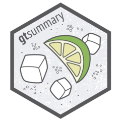
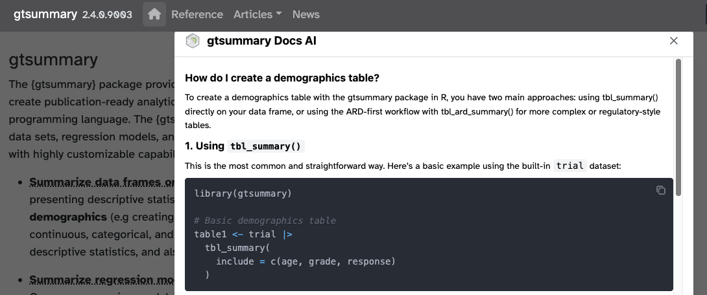
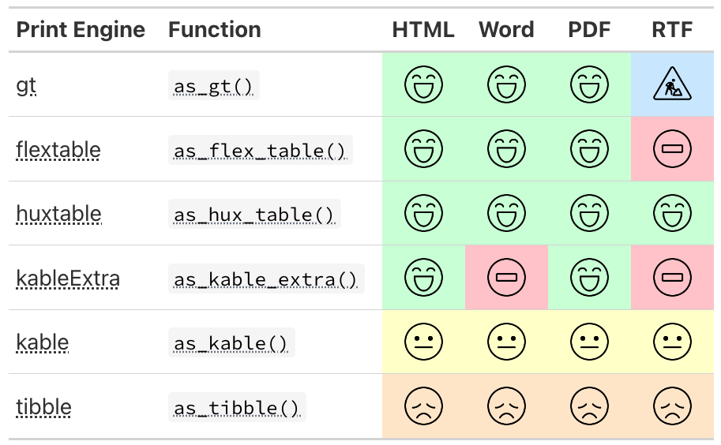
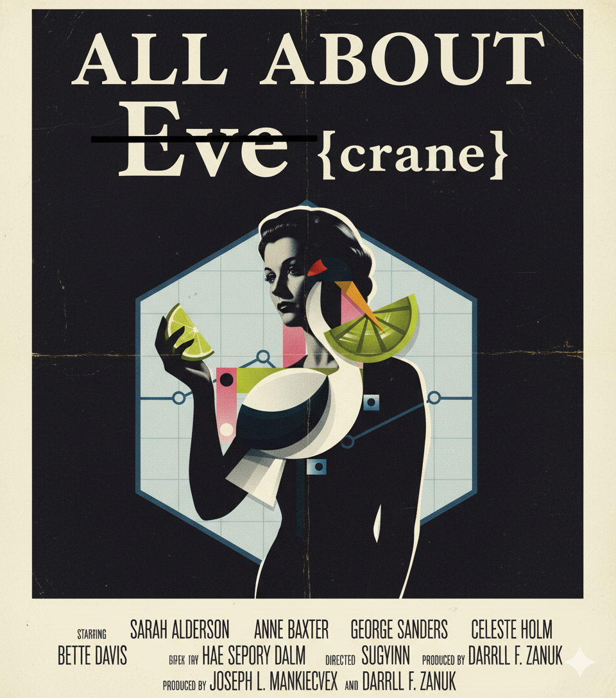
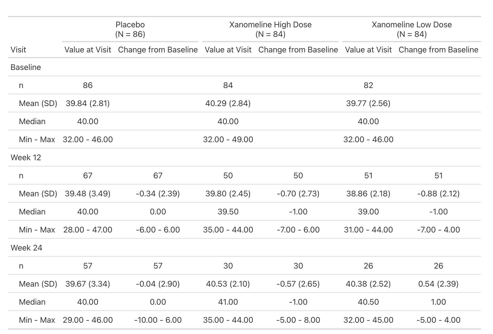
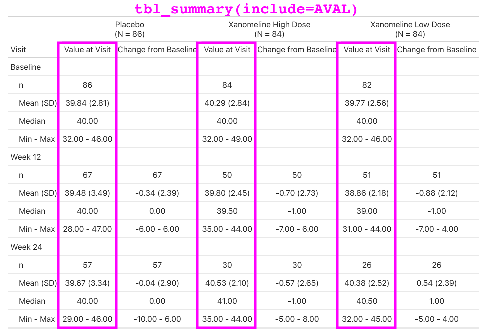
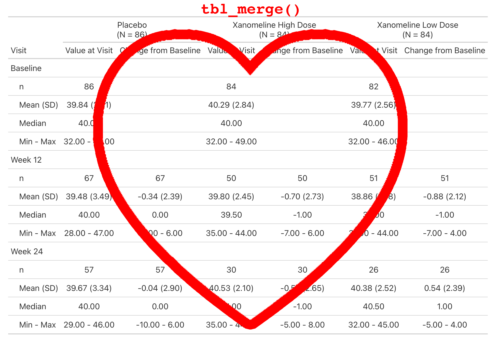
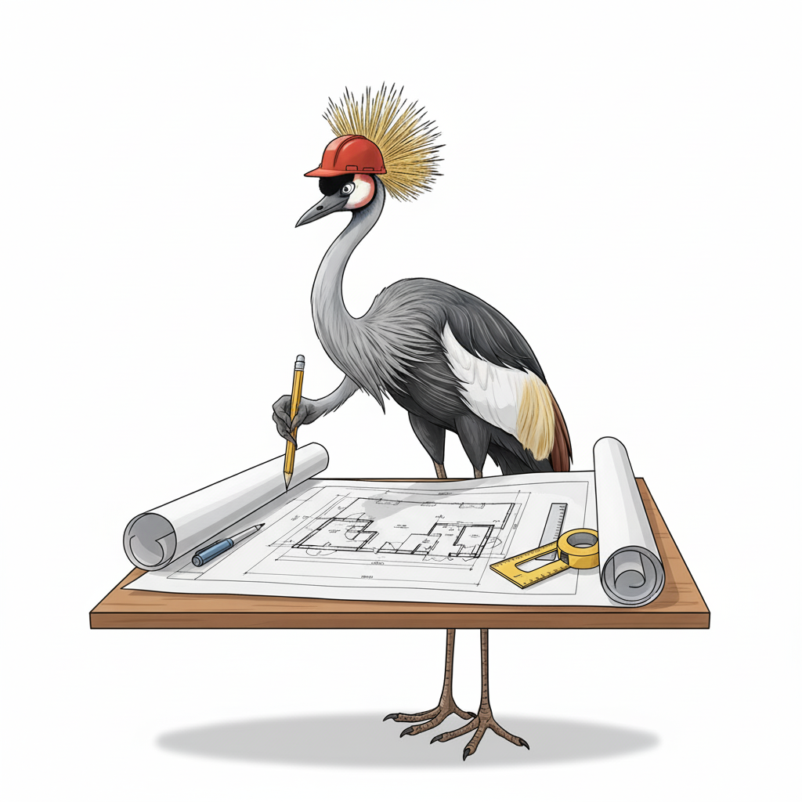

```{r}
#| echo: false
#| cache: false
library(tidyverse)
library(gtsummary)
library(crane)

# fill for font awesome icons
fa_fill <- "#606060"

options(width = 200)
```

## What is {crane} ? 

-   {crane} is the Roche extension to {gtsummary} for Roche's reporting requirements

-   {crane} exports a {gtsummary} theme

-   {crane} exports functions to bespoke summary tables

## But First, What is {gtsummary} ?

:::::::: columns
:::::: {.column width="65%"}
#### How it started

::: small
-   Began to address reproducibility issues while working in academia

-   Goal to build a package to summarize study results with code that was [both simple and customizable]{.emphasis}
:::

:::: fragment
#### How it's going

::: small
-   The stats

    -   [1,700,000 installations]{.emphasis} from CRAN
    -   1,200 GitHub stars
    -   1,000 citations in peer-reviewed articles
    -   50 code contributors

-   Won the 2021 American Statistical Association (ASA) Innovation in Programming Award

-   Won the 2024 Posit Pharma Table Contest

-   Won the 2025 Brian Bole Award of Excellence from R in Pharma
:::
::::
::::::

::: {.column width="35%"}



:::
::::::::

## Monthly {gtsummary} CRAN Downloads

```{r}
#| echo: false
pkgs_all <- 
  c("gtsummary", "stargazer", "arsenal", "rtables",
    "table1", "tableone", "modelsummary",
    "finalfit", "furniture", "compareGroups",
    "tangram", "atable", "texreg", "apsrtable",
    "tables", "qwraps2", "summarytools", "tfrmt", "tidytlg", "Tplyr")
pkgs_pharmaverse <- c("gtsummary", "rtables", "tfrmt", "tidytlg", "Tplyr")

df_30day <- 
  cranlogs::cran_downloads(packages = pkgs_all, from = "2025-08-15", to = "2025-09-15") |> 
  dplyr::summarise(.by = package, count = sum(count)) |> 
  dplyr::arrange(-count) |> 
  dplyr::mutate(
    pharmaverse = package %in% pkgs_pharmaverse
  )

# pharmaverse downloads
df_30day |> 
  dplyr::mutate(
    pharmaverse = ifelse(pharmaverse, "pharmaverse package", "non-pharmaverse package")
  ) |> 
  ggplot(aes(y = count, x = fct_reorder(package, count), color = pharmaverse, fill = pharmaverse)) +
  geom_bar(stat = "identity", linewidth = 0.1) +
  scale_y_continuous(expand = c(0, 0), n.breaks = 20, labels = gtsummary::label_style_number()) +
  scale_x_discrete(label = \(.x) ifelse(.x == "gtsummary", "gtsummary", strrep("x", nchar(.x)))) + 
  coord_flip() +
  labs(x = NULL, y = "30-Day Downloads", color = NULL, fill = NULL) +
  theme_minimal() +
  theme(legend.position = "bottom") +
  ggplot2::theme(axis.text.x = ggplot2::element_text(angle = 20, vjust = 0.8, hjust=0.8)) +
  scale_color_manual(values=c("#DBD6D1", "#007AC2")) +
  scale_fill_manual(values=c("#DBD6D1", "#007AC2")) +
  NULL
```

::: aside
Figure contains 30-day downloads for all summary table packages on CRAN.
:::

## {gtsummary} + LLMs 

- Since {gtsummary} is widely adopted, our LLMs besties work wonderfully out of the box. No additional training needed!
    
- The {gtsummary} site has recently added an AI assistant and it's AMAZING! Powered by `kapa.ai` (thank you!)
    


## This Talk is Not about {gtsummary} 

::: larger
But, I want to touch on two items

1.  {gtsummary} creates beautiful tables that are easy to customize

2.  {gtsummary} supports themes that allow users to change defaults and other details of summary tables
:::

## A Little Data Preparation

```{r}
library(gtsummary)
library(tidyverse)

adsl <- pharmaverseadam::adsl |> 
  filter(SAFFL == "Y") |> 
  mutate(ARM2 = word(ARM), FEMALE = SEX == "F") |> 
  labelled::set_variable_labels(FEMALE = "Female")

adae <- pharmaverseadam::adae |> 
  filter(
    USUBJID %in% adsl$USUBJID,
    AESOC %in% c("CARDIAC DISORDERS", "EYE DISORDERS"),
    AEDECOD %in% c("ATRIAL FLUTTER", "MYOCARDIAL INFARCTION", "EYE ALLERGY", "EYE SWELLING")
  ) |> 
  mutate(ARM2 = word(ARM))

adtte <- pharmaverseadam::adtte_onco |> 
  dplyr::filter(PARAM == "Progression Free Survival") |> 
  mutate(ARM2 = word(ARM))
```

## {gtsummary} Tables 

We will review briefly just one summary table function.

-   `tbl_summary()`


:::: fragment
Other functions helpful functions we're not covering:

::: small

-   `tbl_hierarchical()`: Summarize AE, Con Meds, and other similar rates

-   `tbl_hierarchical_count()`: similar to `tbl_hierarchical()` for counts instead of rates

-   `tbl_cross()`: cross tabulations

-   `tbl_continuous()`: summarizing continuous variables by 2 categorical variables

-   `tbl_wide_summary()`: similar to `tbl_summary()` but statistics are presented in separate columns

-   many more!
:::
::::

## Basic tbl_summary()

::::: columns
::: {.column width="50%"}
```{r}
#| label: 'simple-summary'
library(gtsummary)

adsl |> 
  tbl_summary(
    include = c(AGE, ETHNIC, FEMALE)
  )
```
:::

::: {.column width="50%"}
-   Four types of summaries: `continuous`, `continuous2`, `categorical`, and `dichotomous`

-   Statistics are `median (IQR)` for continuous, `n (%)` for categorical/dichotomous

-   Variables coded `0/1`, `TRUE/FALSE`, `Yes/No` treated as dichotomous by default

-   Label attributes are printed automatically
:::
:::::

## Customize tbl_summary() output {auto-animate="true"}

```{r}
#| output-location: "column"
#| label: 'customize-summary1'
adsl |> 
  tbl_summary(
    include = c(AGE, ETHNIC, FEMALE),
    by = ARM2,
  )
```

:::::: small
::::: columns
::: {.column width="50%"}
-   `by`: specify a column variable for cross-tabulation
:::

::: {.column width="50%"}
:::
:::::
::::::

## Customize tbl_summary() output {auto-animate="true"}

```{r}
#| output-location: "column"
#| label: 'customize-summary2'
adsl |> 
  tbl_summary(
    include = c(AGE, ETHNIC, FEMALE),
    by = ARM2,
    type = AGE ~ "continuous2",
  )
```

:::::: small
::::: columns
::: {.column width="50%"}
-   `by`: specify a column variable for cross-tabulation

-   `type`: specify the summary type
:::

::: {.column width="50%"}
:::
:::::
::::::

## Customize tbl_summary() output {auto-animate="true"}

```{r}
#| output-location: "column"
#| label: 'customize-summary3'
adsl |> 
  tbl_summary(
    include = c(AGE, ETHNIC, FEMALE),
    by = ARM2,
    type = AGE ~ "continuous2",
    statistic = 
      list(
        AGE ~ c("{mean} ({sd})", 
                "{min}, {max}"), 
        FEMALE ~ "{n} / {N} ({p}%)"
      ),
  )
```

:::::: small
::::: columns
::: {.column width="50%"}
-   `by`: specify a column variable for cross-tabulation

-   `type`: specify the summary type

-   `statistic`: customize the reported statistics
:::

::: {.column width="50%"}
:::
:::::
::::::

## Customize tbl_summary() output {auto-animate="true"}

```{r}
#| output-location: "column"
#| label: 'customize-summary4'
adsl |> 
  tbl_summary(
    include = c(AGE, ETHNIC, FEMALE),
    by = ARM2,
    type = AGE ~ "continuous2",
    statistic = 
      list(
        AGE ~ c("{mean} ({sd})", 
                "{min}, {max}"), 
        FEMALE ~ "{n} / {N} ({p}%)"
      ),
    label = 
      AGE ~ "Age, years",
  )
```

:::::: small
::::: columns
::: {.column width="50%"}
-   `by`: specify a column variable for cross-tabulation

-   `type`: specify the summary type

-   `statistic`: customize the reported statistics
:::

::: {.column width="50%"}
-   `label`: change or customize variable labels
:::
:::::
::::::

## Customize tbl_summary() output {auto-animate="true"}

```{r}
#| output-location: "column"
#| label: 'customize-summary5'
adsl |> 
  tbl_summary(
    include = c(AGE, ETHNIC, FEMALE),
    by = ARM2,
    type = AGE ~ "continuous2",
    statistic = 
      list(
        AGE ~ c("{mean} ({sd})", 
                "{min}, {max}"), 
        FEMALE ~ "{n} / {N} ({p}%)"
      ),
    label = 
      AGE ~ "Age, years",
    digits = AGE ~ list(sd = 1) # report SD(age) to one decimal place
  )
```

:::::: small
::::: columns
::: {.column width="50%"}
-   `by`: specify a column variable for cross-tabulation

-   `type`: specify the summary type

-   `statistic`: customize the reported statistics
:::

::: {.column width="50%"}
-   `label`: change or customize variable labels

-   `digits`: specify the number of decimal places for rounding
:::
:::::
::::::

## {gtsummary} + formulas

This syntax is also used in {cards}, {cardx}, {crane}, and {gt}.

<p align="center">


</p>

**Named list are OK too!** `label = list(age = "Patient Age")`

## 

### {gtsummary} selectors

-   Use the following helpers to [select groups of variables]{.emphasis}: `all_continuous()`, `all_categorical()`

-   Use `all_stat_cols()` to select the [summary statistic columns]{.emphasis}

### Add-on functions in {gtsummary}

`tbl_summary()` objects can also be updated using related functions.

-   `add_*()` add [additional column]{.emphasis} of statistics or information, e.g. p-values, q-values, overall statistics, treatment differences, N obs., and more

-   `modify_*()` [modify]{.emphasis} table headers, spanning headers, footnotes, and more

## Update tbl_summary() with add\_\*() {auto-animate="true"}

```{r}
#| label: 'summary-with-overall1'
#| output-location: "column"
#| code-line-numbers: "6"
adsl |>
  tbl_summary(
    by = ARM2,
    include = c(AGE, ETHNIC, FEMALE)
  ) |> 
  add_overall(last = TRUE)
```

-   `add_overall()`: adds a column of overall statistics

## Update tbl_summary() with modify\_\*()

```{r}
#| label: 'summary-modified'
#| output-location: "column"
#| code-line-numbers: "4,5,6,7,8,9,10,11,12,13,14"
tbl <-
  adsl |> 
  tbl_summary(by = ARM2, include = c("AGE", "ETHNIC", "FEMALE")) |>
  modify_header(
    stat_1 ~ "**Group A**",
    stat_2 ~ "**Group B**"
  ) |> 
  modify_spanning_header(
    all_stat_cols() ~ "**Drug**") |> 
  modify_footnote(
    all_stat_cols() ~ 
      paste("median (IQR) for continuous;",
            "n (%) for categorical")
  )
tbl
```

-   Use `show_header_names()` to see the internal header names available for use in `modify_header()`

## Column names

```{r}
#| label: 'column-names'
#| message: true
show_header_names(tbl)
```

<br><br>

::: larger
`all_stat_cols()` selects columns `"stat_1"` and `"stat_2"`
:::

## Add-on functions in {gtsummary}

And many more!

See the documentation at <http://www.danieldsjoberg.com/gtsummary/reference/index.html>

And a detailed `tbl_summary()` vignette at <http://www.danieldsjoberg.com/gtsummary/articles/tbl_summary.html>

## Cobbling Table with {gtsummary}

:::: large
Two or more {gtsummary} tables can be combined by either [merging]{.emphasis} or [stacking]{.emphasis}.

-   `tbl_merge()` for horizontal combining

-   `tbl_stack()` for vertical combining

::: fragment
<br><br> ***But more on this later in the {crane} section***
:::
::::

## {gtsummary} print engines



## Finally, All About {crane}

::::: columns
::: {.column width="50%"}

:::

::: {.column width="50%"}

:::
:::::

## Wrapping Functions 

The first function we added to {crane} was `tbl_roche_summary()`: a *very thin* wrapper for `gtsummary::tbl_summary()`.

::: small
-   Continuous variables default to `continuous2`.

-   `tbl_summary(missing*)` arguments have been changed to `tbl_roche_summary(nonmissing*)`.

    -   We highlight non-missing counts over missing counts, which are the default in {gtsummary}

-   Counts represented by `0 (0%)` print as `0`.
:::

```{r}
#| label: tbl-roche-summary
#| output-location: slide
library(crane)

adsl |> 
  dplyr::mutate(ETHNIC = forcats::fct_expand(ETHNIC, "REFUSED")) |> 
  tbl_roche_summary(
    by = ARM2, 
    include = c(AGE, ETHNIC),
    nonmissing = "always"
  )
```

## Extending with New Functions 

::: small
Lab values are summarized by visit and include the change from baseline.

This is a simple table that is just a `tbl_merge()` of the `AVAL` summary and the `CHG` summary.

But the general structure appears enough times in our catalog, we make it simple for our programmers to create.
:::

```{r}
#| label: tbl_baseline_chg
#| eval: false
library(crane)

adlb |> 
  dplyr::filter(PARAM == "Albumin (g/L)") |> 
  tbl_baseline_chg(
    by = "ARM",
    baseline_level = "Baseline",
    denominator = adsl
  )
```

## Extending with New Functions 

{fig-align="center" width="80%"}

## Extending with New Functions 

{fig-align="center" width="80%"}

## Extending with New Functions 

{fig-align="center" width="80%"}

## Extending with New Functions 

{fig-align="center" width="80%"}

## Create a Company Theme 

Our theme is implemented in `crane::theme_gtsummary_roche()`

Primary changes include:

-   Sets a custom function for [rounding percentages]{.emphasis}.

-   Round all [p-values]{.emphasis} to four decimal places.

-   [Headers]{.emphasis} default to include the N in parenthesis _without_ bold, e.g. `'Placebo  \n (N = 184)'`.

-   All tables are printed with [{flextable}]{.emphasis} and we add Roche-specific styling to the table.

    -   Update the default [font, font size, table borders, cell padding, etc.]{.emphasis} to meet our guidelines.

## Create a Company Theme 

```{r}
#| output-location: column
theme_gtsummary_roche()

adsl |> 
  dplyr::mutate(ETHNIC = forcats::fct_expand(ETHNIC, "REFUSED")) |> 
  tbl_roche_summary(
    by = ARM2, 
    include = c(AGE, ETHNIC),
    nonmissing = "always"
  )
```

## Extend with ARD-first Functionality 

- We don't have time to cover in detail, but there is another wonderful way to create bespoke tables and functions.

- The {gtsummary} package supports creating tables using ARDs (Analysis Results Datasets).

    - Data ➡️ ARD ➡️ Table

- This method is particularly useful for efficacy tables, as they contain statistics that are not our standard rates, counts, and univariate descriptor statistics.

- Review the [ARD-first Vignette](https://www.danieldsjoberg.com/gtsummary/articles/tbl_ard-functions.html) for a detailed walk through.

## Extend with ARD-first Functionality 

```{r}
#| echo: false
reset_gtsummary_theme()
```

```{r}
tbl_survfit_times(
  data = adtte, 
  times = 12, 
  by = "ARM2", 
  label = "Month {time}"
)
```

::: aside
If you prefer not to make an ARD first, you can also just create a data frame of a table and convert it to {gtsummary} and style it from there.
:::

## 


:::::: columns
:::: {.column width="65%"}

::: largest

***When it comes time to build your custom tables, use the {crane} package as a blueprint.***

:::

::::

:::: {.column width="35%"}



::::
::::::


